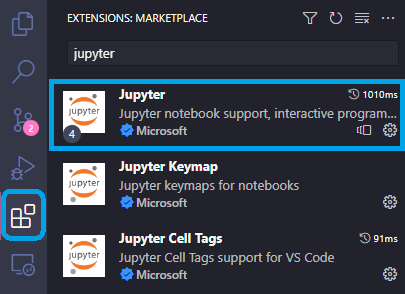
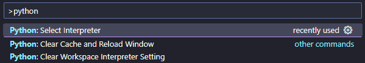
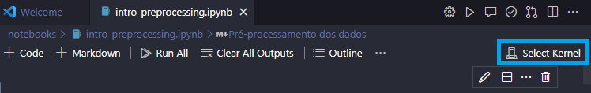

# Introdução ao pré-processamento de dados

Ao trabalhar com Inteligência Artificial, devemos nos preocupar não apenas com a arquitetura e algoritmo inteligente que será usado, mas também com os dados que irão alimentar o modelo.

Usualmente, os dados contém problemas que devem ser tratados, sejam eles tabulares ou não. A etapa de Pré-Processamento dos dados é onde realizamos algumas ações muito importantes, como:

- Limpeza de dados - dados inconsistentes ou faltantes são tratados;
- Transformação dos dados - normalização, codificação e formatação dos dados para o formato necessário;
- *Feature selection* - seleção dos atributos mais relevantes.

O notebook [intro_preprocessing.ipynb](/notebooks/intro_preprocessing.ipynb) apresenta de forma prática uma introdução dessas etapas de pré-processamento de dados.

## Run/Debug

Para executar os códigos, é recomendado criar um ambiente virtual com `Python>=3.9`, pois isso permite que todas as dependências estejam instaladas apenas no projeto em questão, e não globalmente na sua máquina, permitindo um melhor gerenciamento das dependências. Siga os passos seguintes.

### Criação do ambiente virtual

Instale a versão do [Python](https://www.python.org/downloads/windows/), caso seja necessário. Em seguida, execute o código no terminal dentro da pasta raiz do projeto

- Windows/Linux
``` bash
python -m venv .venv
```

### Ativação do ambiente virtual

Execute o código no terminal dentro da pasta raiz do projeto
- Windows (CMD)
``` bash
.venv\Scripts\activate.bat
```

- Windows (PowerShell)
``` bash
.venv\Scripts\Activate.ps1
```

- Linux

``` bash
source .venv/bin/activate
```

Se tudo ocorreu corretamente, no terminal agora sua pasta raiz deve possuir o termo `(.venv)`, similar ao seguinte:

``` bash
(.venv) D:\<path_to_project>
```

### Instalação das dependências

No terminal, execute o seguinte comando:

``` bash
pip install -r requirements.txt
```

## Suporte Jupyter Notebooks no VS Code

O [Visual Studio Code](https://code.visualstudio.com) tem suporte aos Jupyter Notebooks (arquivos com extensão .ipynb). Para entender melhor o que são notebooks, [veja aqui](https://code.visualstudio.com/blogs/2021/11/08/custom-notebooks).

Caso deseje executar os notebooks desse repositório no VS Code:

- Abra o VS Code na pasta raiz do projeto
- No menu "Extensões" do VS Code, instale a extensão `Jupyter`, da Microsoft



- Pressione o atalho `Ctrl+Shift+P` e selecione o comando `Python: Select Interpreter`



- Procure o interpretador que está no ambiente virtual criado anteriormente.

> :warning: certifique-se de que o caminho do ambiente mostrado é similar a `.venv\Scripts\python.exe`, no Windows, ou `.venv/bin/python`, no Linux, para garantir que está selecionando o ambiente virtual correto.

- No notebook, selecione `Select Kernel`



- Em seguida, selecione `Python Environments`

- Selecione o mesmo ambiente virtual que foi criado anteriormente e que foi definido como o interpretador padrão do projeto

- O notebook está pronto para ser executado.
